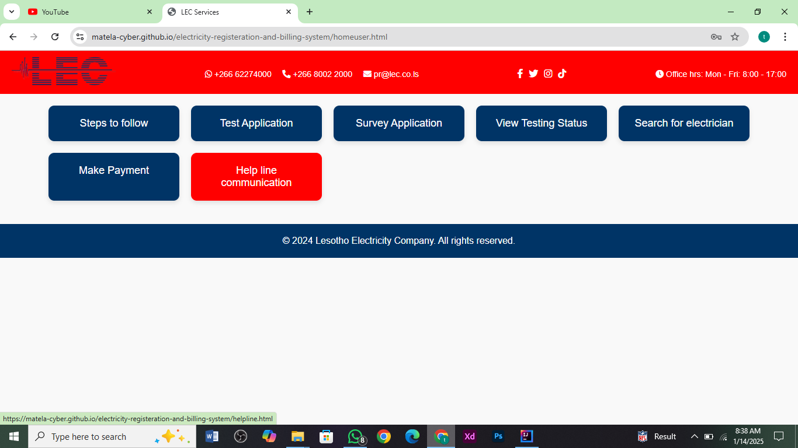

# Electricity Registration and Billing System
try it: https://matela-cyber.github.io/electricity-registeration-and-billing-system/

A web-based application designed to streamline customer registration, service application, inspection scheduling, and billing within an electricity distribution company. This system leverages a NoSQL database for scalable and flexible data management.

## Table of Contents

- [Features](#features)
- [Technologies Used](#technologies-used)
- [Installation](#installation)
- [Usage](#usage)
- [Database Design](#database-design)
- [Project Structure](#project-structure)
- [Contributing](#contributing)
- [License](#license)

## Features

- **Customer Registration**: New customers can create accounts and register for electricity services.
- **Staff Authentication**: Secure login portals for electricians, inspectors, and other staff members.
- **Service Application Management**: Enables customers to submit and track applications for electricity services.
- **Inspection Scheduling**: Facilitates scheduling and tracking of inspections by authorized personnel.
- **Billing and Payments**: Automates bill generation and allows customers to process online payments.
- **Customer Support**: Provides a helpline and resources for customer inquiries.
- **Electrician Search**: Enables customers to find electricians based on location or service availability.

## Technologies Used

- **HTML5**: For building web pages.
- **CSS3**: For styling and responsive design.
- **JavaScript**: For client-side functionality.
- **NoSQL Database**: For flexible and scalable data management.

## Installation

1. **Clone the Repository**:
   ```bash
   git clone https://github.com/Matela-cyber/electricity-registeration-and-billing-system.git
   cd electricity-registeration-and-billing-system
   ```

2. **Open the Application**:
   - Locate the `index.html` file in the project directory.
   - Open it in your preferred web browser to launch the application.

## Usage

1. **Launch the Application**:
   - Open `index.html` in a web browser.
2. **Customer Registration**:
   - Navigate to the registration page to create a new account.
3. **Staff Login**:
   - Use login portals for electricians, inspectors, or other staff members.
4. **Submit Service Applications**:
   - Customers can apply for new connections or services.
5. **Manage Inspections**:
   - Inspectors can view and update inspection schedules.
6. **Billing**:
   - Customers can view bills and make online payments.
7. **Support**:
   - Use the helpline or electrician search for assistance.

## Database Design

The application uses a NoSQL database to store and manage data efficiently. This structure allows for flexibility in handling various types of data across collections.

### Collections Overview:

1. **Users**:
   - Stores information about customers and staff members.
   - Example document:
     ```json
     {
       "_id": "user123",
       "name": "John Doe",
       "email": "johndoe@example.com",
       "role": "customer",
       "passwordHash": "hashedPassword",
       "createdAt": "2024-01-01T12:00:00Z"
     }
     ```

2. **Applications**:
   - Tracks service applications submitted by customers.
   - Example document:
     ```json
     {
       "_id": "application456",
       "userId": "user123",
       "type": "new_connection",
       "status": "pending",
       "submittedAt": "2024-01-10T10:00:00Z"
     }
     ```

3. **Inspections**:
   - Records scheduled inspections and their details.
   - Example document:
     ```json
     {
       "_id": "inspection789",
       "applicationId": "application456",
       "inspectorId": "staff001",
       "scheduledAt": "2024-01-15T14:00:00Z",
       "status": "scheduled"
     }
     ```

4. **Bills**:
   - Stores customer billing information.
   - Example document:
     ```json
     {
       "_id": "bill001",
       "userId": "user123",
       "amount": 150.75,
       "dueDate": "2024-02-01T23:59:59Z",
       "status": "unpaid"
     }
     ```

5. **Support Queries**:
   - Logs customer inquiries for helpline or assistance.
   - Example document:
     ```json
     {
       "_id": "supportQuery321",
       "userId": "user123",
       "query": "Need assistance with payment",
       "createdAt": "2024-01-12T08:30:00Z",
       "status": "open"
     }
     ```

## Project Structure

```plaintext
electricity-registeration-and-billing-system/
├── AllForms.html
├── SurveyApp.html
├── UserApplicationForm.html
├── createacc.html
├── customerlogin.html
├── electricianForm.html
├── eletricianlogin.html
├── helpline.html
├── homeuser.html
├── index.html
├── inspection.html
├── inspectorlogin.html
├── lecstafflogin.html
├── logo.png
├── mail.js
├── payment.html
├── reply.html
├── searchele.html
├── seeInspectionStatus.html
└── README.md
```
## Screen shots



## Contributing

Contributions are welcome! Follow these steps:

1. **Fork the Repository**.
2. **Create a Feature Branch**:
   ```bash
   git checkout -b feature/your-feature-name
   ```
3. **Commit Changes**:
   ```bash
   git commit -m "Add new feature: your-feature-name"
   ```
4. **Push to the Branch**:
   ```bash
   git push origin feature/your-feature-name
   ```
5. **Submit a Pull Request**.

## License

This project is licensed under the MIT License. See the [LICENSE](LICENSE) file for details.

For any issues or suggestions, please open an issue in this repository.
